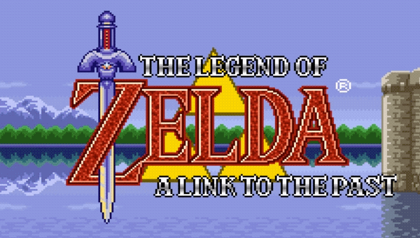

**Fecha de lanzamiento:** 21 de noviembre de 1991.

**Plataforma:** Super Nintendo, Game Boy Advance, Wii, Nintendo 3DS, Wii U.

**Distribuidor:** Nintendo.

**Impacto:** A nivel comercial fue uno de los juegos más vendidos de la SNES con cerca de 4,61 millones de copias. Asímismo es uno de los videojuegos clásicos de la saga que más características reune respecto a los actuales como las mazmorras multinivel, los entornos dinámicos o la Espada Maestra.

**Curiosidades:** 

# Niveles del juego
## Nivel 1: Overworld
Se compone de el poblado inicial y de diversas zonas con enemigos con los que Link tendrá que abrirse paso y recolectar la bomba que le permitirá entrar al castillo de Ganon.

## Nivel 2: Castillo de Ganon
Varias salas con varios enemigos donde Link tendrá que utilizar su astucia para poder resolver los malignos puzzles de Ganon y así enfrentarte a él.

# Sprites

# Mecánicas con los que contará el juego
* **Combate:** Link atacará en las casillas adyacentes con su espada en dirección que mire Link.

* **Objetos:** Link puede coger pociones que se utilizarán de forma automatica para recuperar salud entre otros como las vasijas.

* **Corazones:** Link y los enemigos tienen cierto número de "puntos de impacto" que pueden soportar antes de morir.

* **Interacción con escenario:** Levantar arbustos, rocas, abrir cofres, abrir puertas, leer carteles, ...

* **NPCs:** Hablar con los hyrulianos para obtener información.

* **Armería:** Poder cambiar tus diversas armas.

* **Interfaz:** La armería, puntuación (rupias), salud, etc.

# Condiciones de finalización.
**Victoria:** Consigues salvar a Zelda Williams (no a Link).

**Derrota:** Link muere. 

